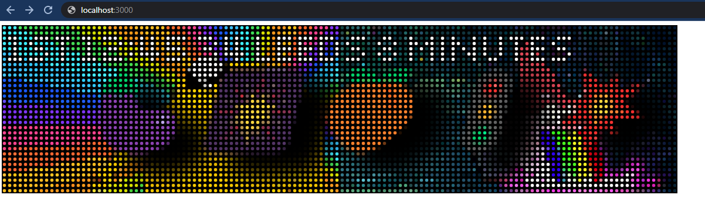
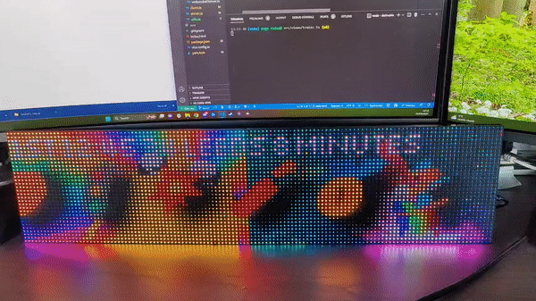

# Dot Matrix

## ❓About
This project is me experimenting with hub75 dot matrix panels. 

It renders a UI to a HTML canvas (using PIXI.js) and streams the pixel data to an ESP32 micro controller via a websocket. It then [uses this library](https://github.com/mrfaptastic/ESP32-HUB75-MatrixPanel-DMA) to render this pixel data onto the display.

This setup allows me to quickly iterate on the UI and stream any data directly to the display.

## 📺 Demo

### Browser View

### Hub75 Matrix View
